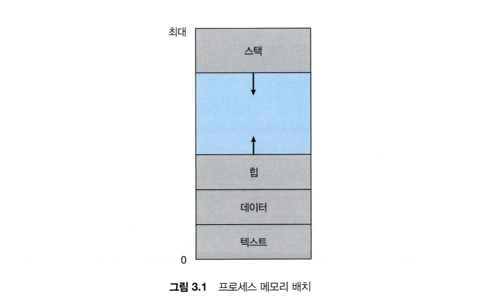
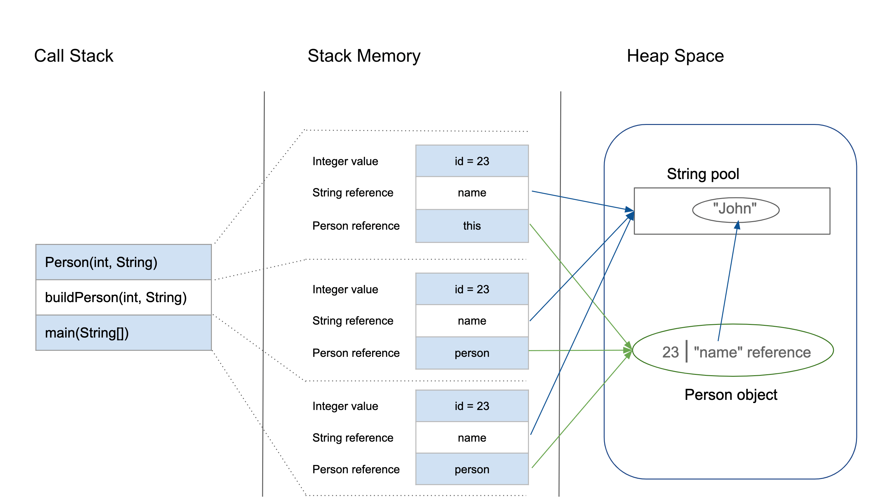

# 프로세스 주소 공간
- 프로세스는 운영체제가 자원을 할당하는 단위이다.
- 프로세스가 메모리를 할당받으면, 자신만의 방법으로 메모리를 관리하기 위해 이 공간들을 어떠한 구조로 관리하는데, 이를 __프로세스 주소 공간__ 이라고 부른다.

## 구조
<p align="center"></p>

- 프로세스의 주소 공간은 대략적으로 다음과 같이 생겼으며, 각각의 구역을 살펴보면 다음과 같다.

### Stack 영역
- 함수의 호출과 관계되는 지역 변수와 매개변수가 저장되는 영역이다.
- Stack 영역의 값은 함수의 호출과 함께 할당되며, 함수의 호출이 완료되면 소멸한다.
- 메모리의 높은 주소에서 낮은 주소의 방향으로 할당된다.
- 재귀 함수가 너무 깊게 호출되거나 함수가 지역변수를 너무 많이 가지고 있어 stack 영역을 초과하면 stack overflow 에러가 발생한다.

### Heap 영역
- 런타임에 크기가 결정되는 영역이다.
- 사용자에 의해 공간이 동적으로 할당 및 해제된다.
- 주로 참조형 데이터 (ex. 클래스) 등의 데이터가 할당된다.
- 메모리의 낮은 주소에서 높은 주소의 방향으로 할당된다.

### Data 영역
- 전역 변수나 Static 변수 등 프로그램이 사용할 수 있는 데이터를 저장하는 영역이다.
- 어떤 프로그램에 전역/static 변수를 참조하는 코드가 존재한다면, 이 프로그램은 컴파일 된 후에 data 영역을 참조하게 된다.
- 프로그램의 시작과 함께 할당되며, 프로그램이 종료되면 소멸한다.
- 단, 초기화 되지 않은 변수가 존재한다면, 이는 BSS 영역에 저장된다.

### Text (Code) 영역
- 프로그램이 실행될 수 있도록 CPU가 해석 가능한 기계어 코드가 저장되어 있는 공간이다.
- 프로그램이 수정되면 안되므로 ReadOnly 상태로 저장되어 있다.


## 적용
- 메모리는 한정되어 있기 때문에, 프로세스는 다양한 방법으로 메모리를 절약하려고 시도한다.
- 그렇다면 어떤 방식으로 최적화를 할까? 그리고 최적화 이외의 토픽들은 없을까? 한 번 알아보자.

### Data 영역과 Stack 영역
- Code 영역은 기계어 코드가 들어있으니 다른 구역과 너무 다르고, Heap 영역은 런타임에 크기가 결정되는 영역이다.
- 그렇다면 Stack 영역과 Data 영역을 구분한 이유는 무엇일까? 가장 큰 이유는 역할의 분배이다.
  - 우리는 Stack 영역을 통해 함수의 흐름을 관리하고, Data 영역 (+BSS 영역)을 통해 전역 변수, static 변수를 관리한다.
- 만약 한 프로세스가 여러 개의 스레드를 갖는다면, 각각의 스레드는 자신만의 Stack 영역을 갖는다.
  - 이는 스레드 내에서 수행되는 함수의 흐름을 각각 관리하기 위함이다.
- 여기에서 영역을 구분한 또 다른 중요한 이유가 나오는데, 바로 Data 영역의 공유이다.
  - 각각의 스레드는 Stack 영역을 갖긴 하지만 Data 영역은 공유한다.
  - 즉, 각각의 스레드가 사용하기 위해 Data 영역의 동일한 내용을 공유함으로써, 똑같은 공간을 여러 개 만들지 않고 메모리를 절약할 수 있다. (이는 Code 영역에서도 마찬가지이다.)

### Heap의 크기와 Stack 크기의 고찰
```bash
java -Xmx4096m test
```
- 해당 명령어는 test 라는 이름을 갖는 프로그램을 JVM 상에서 실행하되, 최대 힙 크기를 4096M (= 4G) 할당하라는 의미이다.
- 추가로, UNIX 계열 운영체제의 경우 다음과 같은 명령어를 통해 Stack 영역의 최대 크기를 확인할 수 있다.

```bash
ulimit -s
```
- 이 명령어를 이용하면 Stack 영역의 최대 크기를 수정할 수도 있지만, 현재 최대 크기도 확인할 수 있는데, 딱 8MB 라고 나올 것이다.
- Stack 영역과 Heap 영역은 같은 공간을 공유하는게 아니었나? 왜 필요한 크기가 다를까?

<p align="center"></p>

- 위 그림은 Java에서의 Stack 영역과 Heap 영역을 나타낸다. 잘 살펴보면, Stack 영역에 등장하는 각각의 변수들은 Heap 영역에 위치한 실제 Object의 참조를 갖고 있는 것을 볼 수 있다.
  - 즉, 실제 객체는 Heap 영역에서 관리되기 때문에 Stack 영역의 크기는 생각보다 클 필요가 없다는 것을 알 수 있다.
- 클 필요가 없다는 것은 알았는데, 그렇다면 정말 두 영역은 서로 같은 공간을 공유하는게 아닌건가?
  - 사실, Stack 영역은 생성과 동시에 크기가 정해진다. 즉, 크기가 한 번 정해지면 바뀌지 않기 때문에, Heap 영역과 상관 없이 크기의 제한을 갖는다.
  - 즉, 우리가 자주 볼 수 있는 Stack Overflow 같은 문제는, 힙 영역을 침범해서가 아니라 정해진 Stack 영역의 크기를 초과해서 발생한 문제라고 볼 수 있다.

### 스레드가 여러 개 있다면?
- 프로세스가 자원을 할당 받지만, 스레드도 자신만의 자원을 갖고 있어야 한다. 따라서, 스레드도 자신만의 주소 공간을 갖고 있다.
- 하지만, 약간의 차이가 있다.

<p align="center"></p>

- 다음 그림과 같이, 실제로 각 스레드가 갖고 있는 것은 Stack 영역밖에 없다!
  - 즉, 나머지 공간은 프로세스의 값을 함께 쓰고 있고, 즉 다른 스레드와 공유한다고 볼 수 있다.
- 이 때문에, Data 영역에 있는 자원은 동시에 여러 스레드가 접근할 수 있고, 여기서 발생하는 문제를 해결하기 위해 동기화에 대해 알아야 한다.
