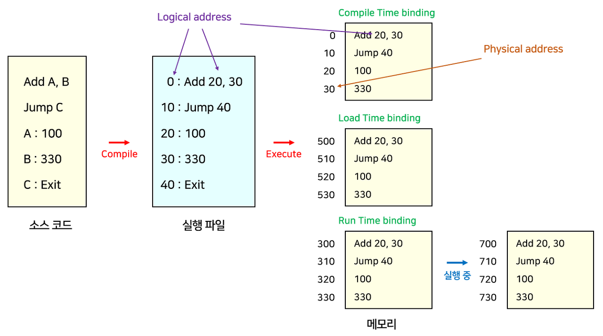
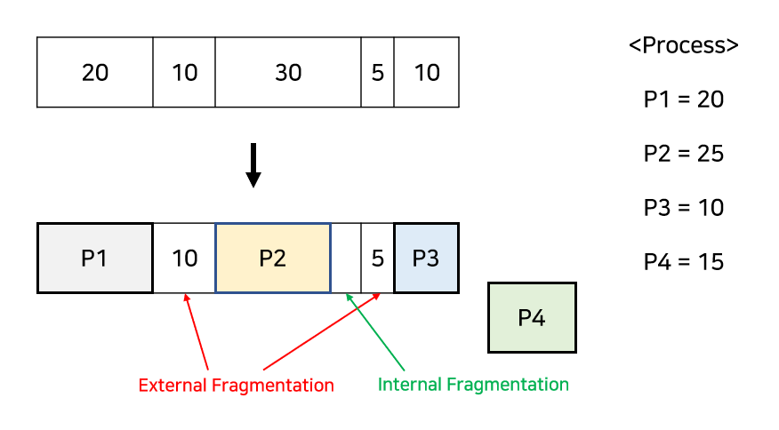
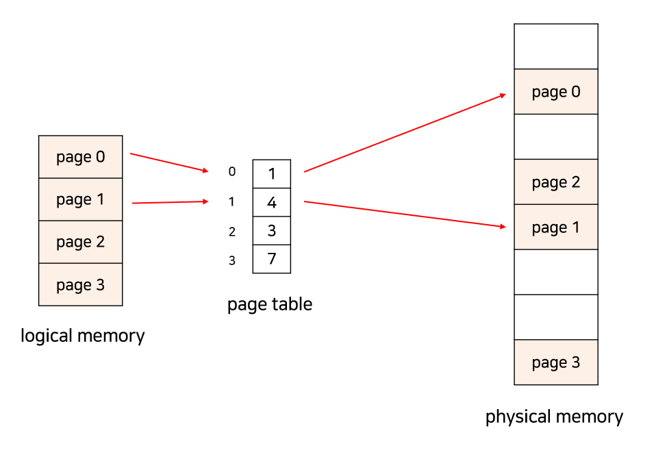
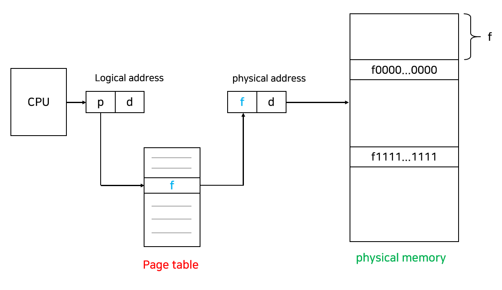
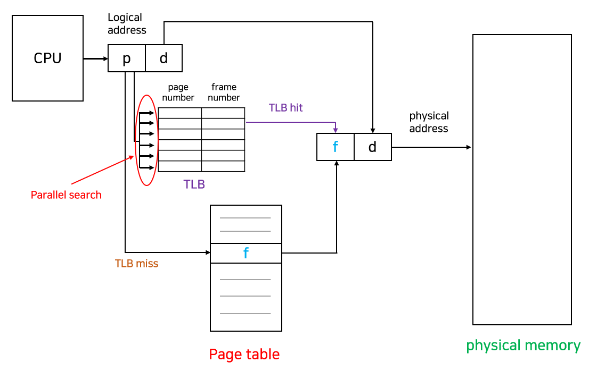
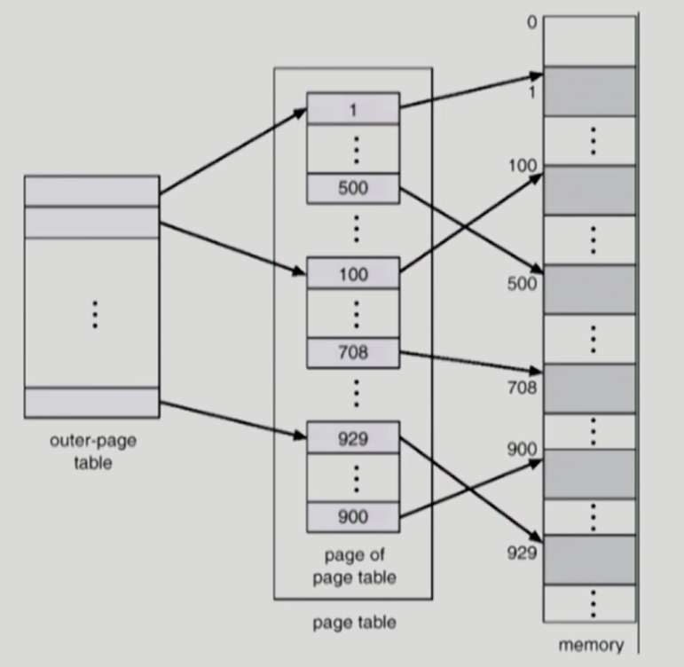
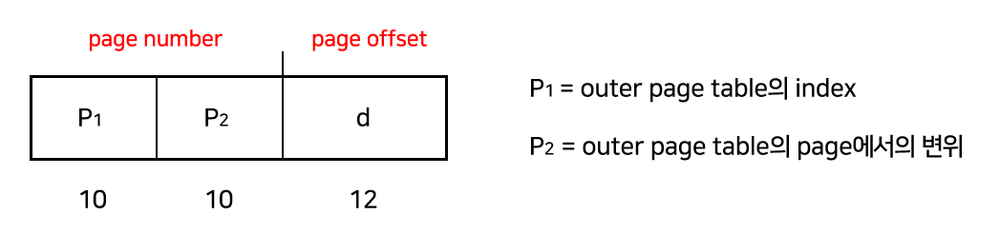
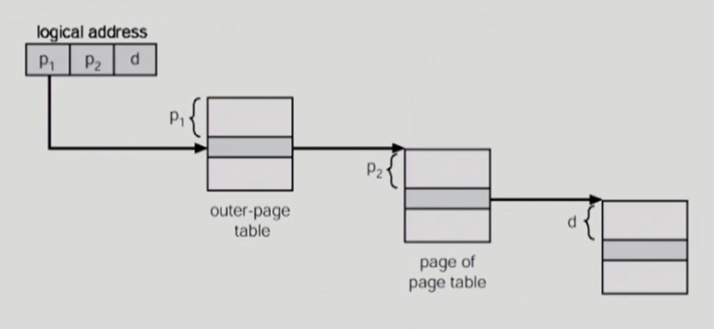
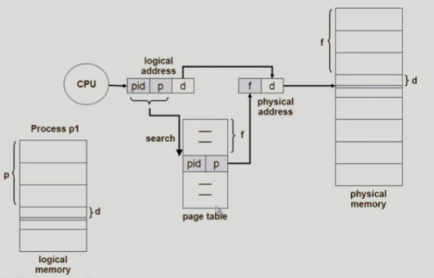

# 메모리 관리
## 1. Address Binding
- 프로세스의 주소(Address)는 논리적 주소(Logical address)와 물리적 주소(Physical address)로 나뉜다. 
  - 논리적 주소는 가상 주소(Virtual address)라고도 하며, CPU가 생성하는 주소이다. 프로세스마다 독립적으로 가지는 주소 공간이기 때문에 프로세스의 내부에서 사용하고, 각 프로세스마다 0부터 시작한다. 
  - 물리적 주소는 프로세스가 실행되기 위해 실제로 메모리(RAM)에 올라가는 위치이다. 
- __Address Binding__ 은 어떤 프로그램이 메모리의 어느 위치에, 즉 어떤 물리적 주소에 load 될지를 결정하는 과정이다. 
  - 이는 binding 하는 시점에 따라 분류된다. 

### 1) Compile Time 
- 프로세스의 물리적 주소가 컴파일 때 정해진다.
  - 프로세스가 메모리의 어느 위치에 들어갈지 미리 알고 있다면 컴파일러가 절대 주소(Absolute address), 즉 고정된 주소를 생성한다.
  - 따라서 만약 위치가 변경된다면 재컴파일을 해주어야 한다. 
- 컴파일 타임 주소 할당은 프로세스 내부에서 사용하는 논리적 주소와 물리적 주소가 동일하다. 
- 컴파일 타임 주소 할당의 문제점은, 주소가 고정되어 있기 때문에 메모리 상에 빈 공간이 많이 발생할 수 있어 비효율적이고, 로드하려는 위치에 이미 다른 프로세스가 존재할 수 있다.  

### 2) Load Time 
- 프로세스가 메모리의 어느 위치에 들어갈지 미리 알 수 없다면 컴파일러는 Relocatable code를 생성해야 한다.
  - Relocatable code는 메모리의 어느 위치에서나 수행될 수 있는 기계 언어 코드이다.
- 그리고 Loader가 프로세스를 메모리에 load 하는 시점에 물리적 주소를 결정한다. 
- 따라서 로드 타임 주소 할당은 논리적 주소와 물리적 주소가 다르다.
- 하지만, 프로세스 내에 메모리를 참조하는 명령어들이 많아서 이들의 주소를 다 바꿔줘야 하기 때문에, 로딩할 때의 시간이 매우 커질 수 있다는 단점이 있다. 
- 따라서 컴파일 타임과 로드 타임 주소 할당은 실제로 잘 쓰이지 않는다. 

### 3) Execution Time (Run time)
- 프로세스가 수행이 시작된 이후에 프로세스가 실행될 때 메모리 주소를 바꾸는 방법이다.
  - 즉, Runtime때 물리적 주소가 결정되며 실행 도중에 주소가 바뀔 수 있다.
  - CPU가 주소를 참조할 때마다 address mapping table을 이용하여 binding을 점검한다. 
- 런타임 주소 할당은 __MMU(Memory Management Unit)__ 라는 하드웨어 장치를 사용하여 논리적 주소를 물리적 주소로 바꿔준다.
  - 프로세스가 CPU에서 수행되면서 생성해내는 모든 주소값에 대해서 base register의 값을 더해주어 물리적 주소를 생성하는 방식이다.
  - base register는 하나이므로 프로세스끼리 공유한다. 
- 아래의 그림은 MMU가 어떤 방식으로 프로세스의 논리적 주소를 물리적 주소로 변환되는지를 보여준다. 

- Limit register는 논리적 주소의 범위이며, 잘못된 메모리를 참조하지 않도록 막아주는 기능을 한다.
- Base register(Relocation register)는 접근할 수 있는 물리적 주소의 최솟값을 나타낸다. 
- 주의해야 할 점은, 만약 커널 모드인 경우에는 MMU가 물리적인 주소로 변환하지 않고 논리적 주소를 그대로 사용한다. 따라서 커널 모드인지 체크하는 과정도 포함되어 있다. 

## 2. Swapping
- 메모리는 크기가 크지 않기 때문에 프로세스를 임시로 디스크에 보냈다가 다시 메모리에 로드해야 하는 상황이 생긴다.
  - 이 때 디스크로 내보내는 것을 swap out, 메모리로 들여보내는 것을 swap in이라고 한다.
  - 일반적으로 중기 스케줄러에 의해 swap out 시킬 프로세스를 선정하며, 우선순위에 따라 어떤 프로세스를 swap in/out 할지 결정한다.
  - 우선순위가 낮은 프로세스를 swap out 시키고, 높은 프로세스를 메모리에 올려놓는 방식이다. 
- 만약 Compile time 이나 Load time binding 인 경우 원래 메모리 위치로 swap in 해야 하고, Execution time binding인 경우 추후 빈 메모리 영역 아무 곳에나 올릴 수 있다. 
- swap 하는데 걸리는 시간의 대부분은 디스크 전송 시간이다. 

## 3. Contiguous Allocation
- 메모리는 일반적으로 커널 영역과 사용자 프로세스 영역으로 나뉘어서 사용된다.
- 그중 사용자 프로세스 영역의 할당 방법으로는 Contiguous Allocation(연속적 할당), Noncontiguous Allocation(비연속적 할당)으로 나뉜다.

### 정의 및 특징
- Contiguous Allocation 시스템은 말 그대로, 각 프로세스들이 연속적인 메모리 공간을 차지하게 되는 것이다.
- Contiguous Allocation에서 메모리를 분할하는 각 단위는 Block이고, 프로세스가 사용할 수 있는 Block을 Hole이라고 한다. 
  - 다양한 크기의 Hole들이 메모리 여러 곳에 흩어져 있고, 프로세스가 도착하면 수용 가능한 Hole을 할당시켜준다. 
- 각 프로세스를 메모리에 담기 위해 메모리는 미리 공간을 분할해두는데, 고정된 크기로 나누는 고정 분할 방식과 프로세스의 크기를 고려해서 나누는 가변 분할 방식이 있다.

### 고정 분할과 가변 분할 
- 고정 분할(Fixed partition)은 분할의 크기가 모두 동일하거나 혹은 서로 다를 수 있다.
  - 분할 당 하나의 프로세스가 적재되기 때문에 동시에 메모리에 load 되는 프로세스의 수가 고정된다.
  - 또 수행 가능한 프로세스의 최대 크기가 제한된다. 
- 가변 분할(Variable partition)은 프로세스의 크기를 고려해서 할당하기 때문에 분할의 크기나 개수가 동적으로 변한다.
  - 이를 위해서는 기술적인 관리 기법이 필요하다. 
  - 가변 분할 방식에서 크기가 n인 프로세스가 들어갈 가장 적절한 Hole을 찾는 문제를 Dynamic Storage-Allocation Problem이라고 하는데, 세 종류의 해결법이 있다.

### Dynamic Storage-Allocation Problem 해결법
#### 1) First-fit
- 크기가 n 이상인 Hole 중 최초로 발견한 Hole에 할당한다. 

#### 2) Best-fit
- 크기가 n 이상인 가장 작은 Hole을 찾아 할당한다.
- Hole들이 크기 순으로 정렬되지 않은 경우 모든 Hole을 탐색해야 한다.
- 항상 거의 딱 맞는 크기를 할당하기 때문에 할당 후에 아주 작은 Hole들이 많이 생성된다.

#### 3) Worst-fit
- 가장 큰 Hole에 할당한다.
- 마찬가지로 모든 Hole을 탐색해야 하고, 상대적으로 아주 큰 Hole들이 새로 생성된다. 

- First-fit과 Best-fit이 Worst-fit에 비해서는 속도나 공간 측면에서 효과적인 것으로 알려져 있으나, 전체적으로 효율이 좋지 않은 편이다. 

## 4. Fragmentation
- Fragmentation(단편화)은 프로세스들이 메모리에 적재되고 제거되는 일이 반복되면 프로세스들이 차지하는 메모리 틈 사이에 사용하지 못할 만큼의 작은 공간들이 늘어나게 되는 현상을 말한다. 

### 외부 단편화(External Fragmentation)와 내부 단편화(Internal Fragmentation)

- 외부 단편화는 총 공간을 계산했을 때 프로세스가 들어갈 수 있는 메모리가 있음에도 불구하고 공간들이 연속하지 않아 사용할 수 없는 경우를 말한다. 
- 내부 단편화는 프로세스가 사용하는 메모리 공간보다 분할된 공간이 더 커서 메모리가 남는 경우를 말한다.
  - 예를 들어 1000 크기의 분할이 있고 990 크기의 프로세스가 들어갈 때, 10만큼의 공간이 남게 되는데 이 현상을 내부 단편화라고 한다. 
- 고정 분할은 외부 단편화와 내부 단편화 모두 발생할 수 있고, 가변 분할은 외부 단편화가 발생할 수 있다. 
- 외부 단편화를 해결할 수 있는 방법으로 Compaction(압축)이 있다.
  - Compaction은 프로세스가 사용하는 공간들을 한쪽으로 몰아서 공간을 확보하는 방법이다.
  - 하지만 Compaction은 비용이 매우 많이 드는 작업이므로 효율이 좋지 않다. 

## 5. Paging
- Paging(페이징)은 Noncontiguous Allocation 방식이다. 
- 외부 단편화의 압축 작업의 비효율성을 해결하기 위한 방법으로, 메모리는 프레임(Frame), 프로세스는 페이지(Page)라 불리는 고정 크기의 블록(Block)으로 분리된다.
  - 블록의 크기는 2의 거듭제곱 꼴이다. 
- 한 프로세스가 사용하는 공간은 여러 page로 나뉘어 관리되고, 각각의 page는 순서와 관계없이 메모리의 frame에 mapping 되어 저장된다. 
- 프로세스가 순서대로 메모리에 저장되지 않기 때문에 프로세스를 실행하기 위해선 page가 어느 frame에 들어있는지를 알아야 한다.  
  - 이에 대한 정보가 page table이라는 테이블에 저장되어 있고, 이를 사용하여 논리적 주소를 물리적 주소로 변환한다.

### 장점
- page들이 연속할 필요가 없어 외부 단편화를 해결할 수 있다.
- 할당과 해제가 빠르다.
- swap out이 간단하다.
- 코드를 쉽게 공유할 수 있다(Shared pages). 코드가 pure code라면 공유가 가능하며 read-only로 프로세스 간에 하나의 코드만 메모리에 올린다. 

### 단점
- 내부 단편화를 해결하지 못한다.
- page table을 저장하기 위한 메모리가 추가로 소모된다.
- page table이 메모리에 상주하기 때문에 메모리에 접근하는 연산은 2번의 메모리 접근이 필요하게 되어 속도가 느리다. (page table에 접근 + 실제 연산)

### 속도 향상  
- 속도 향상을 위해 Associative register 혹은 TLB(Translation Look-aside Buffer)라 불리는 고속의 하드웨어 캐시를 사용한다. 

### Logical address 구성
- page nubmer + page offset
- page number는 page table의 인덱스로써 page table에 접근할 때 사용된다.
- page offset은 물리적 주소를 얻을 때 사용되고, page table의 base address에 page offset을 더하면 물리적 주소를 구할 수 있다. 

- page table은 프로세스마다 존재하며 메인 메모리에 상주한다.
  - page table이 대부분 매우 크기 때문에 이를 구현하기 위해 비용이 비싼 register를 사용하는 것은 적절하지 않기 때문이다. 
- 따라서 page table은 메인 메모리에 저장하고, PTBR(Page-Table Base Register)라는 레지스터가 page table을 가리키도록 한다.
  - 만약 Context Switch가 발생하는 경우 이 레지스터의 내용만 변경하면 된다. 

- page table의 각 엔트리(Entry)에는 정보를 담고 있는 bit가 포함되어 있다. 
  - Protection bit : page에 대한 접근 권한 (read / write / read-only)
  - Valid-invalid bit : valid는 해당 주소의 frame에 그 프로세스를 구성하는 유효한 내용이 있음. invalid는 없음(접근 불허)
- 메모리 할당이 contiguous 한 경우 Limit만 비교해도 메모리를 보호할 수 있었지만, paging은 contiguous하지 않기 때문에 valid-invalid bit을 이용하여 valid면 해당 page에 접근할 수 있도록 한다. 
- page의 크기가 작아질수록 내부 단편화가 감소하고 필요한 정보만 메모리에 있어서 메모리 이용에서 효율적이지만, page table의 크기가 증가하고 디스크 이동의 효율성이 감소한다.
  - 따라서 요즘은 page의 크기를 키워주는 흐름이다.  

## 6. Translation Look-aside Buffer
### 정의 및 특성
- TLB(Translation Look-aside Buffer)는 메모리 주소 변환을 위한 별도의 캐시 메모리로, page table에서 빈번히 참조되는 일부 엔트리를 caching 하고 있다.
- TLB는 key-value 쌍으로 데이터를 관리하는 associative memory이며, key에는 page number, value에는 frame number가 대응된다.

### 동작 방식

- CPU는 page table보다 TLB를 우선적으로 참조하여, 만약 원하는 page가 TLB에 있는 경우 곧바로 frame number를 얻을 수 있고, 그렇지 않은 경우 메인 메모리에 있는 page table로부터 frame number를 얻을 수 있다.
- 원하는 엔트리가 TLB에 존재하는지 알기 위해선 TLB 전체를 다 찾아봐야 하는 단점이 있다. 다만, parallel search가 가능하므로 탐색하는 시간은 적다. 
- TLB의 성능을 높이고 싶다면 page의 크기를 키우는 방법이 있다. 
- TLB에서 찾아지는 비율을 a라고 하고, TLB를 탐색하는데 걸리는 시간을 b라고 하면, 메모리 접근 횟수의 기댓값은 
  - TLB에서 찾은 경우 + 못 찾은 경우 = (b+1)*a + (b+2)*(1-a) = 2+b-a가 된다. 
  - b는 일반적으로 매우 작은 값이고, a는 값이 크다. 실제로 Block이 어디에나 위치할 수 있어 Cache miss의 문제가 적기 때문이다.
  - 따라서 기존의 메모리 접근 횟수인 2보다 훨씬 작은 값이 된다. 

### Context Switch가 발생하는 경우에는 TLB가 어떻게 처리될까?
- 먼저, 매 Switch마다 TLB 전체를 비우는 방법이 있다. 이 방법은 당연하게도 비용이 비싸다는 단점이 있다. 
- 따라서, TLB의 각 엔트리가 어느 프로세스를 위한 것인지 추적하여 이용되지 않는 엔트리만 비우는 게 좋다.
  - 이를 ASID(Address Space Identifier)를 이용하여 해결한다.
- ASID는 Process ID와 유사하지만 8bit로, 32bit인 PID보다 저렴하다. 동
  - 일한 ASID를 갖는 프로세스끼리는 TLB를 공유할 수 있기 때문에, 이런 경우엔 TLB를 비우는 오버헤드를 줄일 수 있다. 

### TLB miss가 났다면? 
- 이러한 경우에는 하드웨어와 운영체제가 모두 관여한다. 
- 하드웨어가 page table에서 유효한 엔트리가 있는지를 확인한다. 만약 유효한 엔트리가 없다면 page fault를 발생시키고 이를 운영체제가 다룬다. 
- 그리고 TLB miss가 발생하면 CPU가 운영체제에 trap을 발생시켜 커널 모드로 바꾼 뒤 명령어를 TLB에 load 한 후 재시작한다.  

 
## 7. Structure of the Page Table
- 현대 컴퓨터는 주소 공간이 매우 큰 프로그램을 지원한다. 32 bit 주소를 사용하는 경우 4GB의 주소 공간을 사용한다.
- 이 때 page의 크기가 4KB이면 약 100만 개의 page table entry가 필요하다.
  - 그러나 대부분의 프로그램은 4GB 중 매우 일부분만 사용하므로 page table 공간이 심하게 낭비된다. 

### page table을 효율적으로 구성하는 방법 
#### 1) Multi-level paging
- 논리적 주소 공간을 여러 단계의 page table로 분할하여 오직 사용되는 page의 page table만 할당하는 기법이다.
  - 이를 통해 각각의 page table이 Noncontiguously 하게 할당되도록 하는 것이 목표이다.
- 간단한 예로 Two-level paging을 살펴보자.
  - Two-level paging은 말 그대로 page table과 메모리 사이에 page table을 하나 더 둠으로써 두 단계를 거치는 방법이다.
  - 이를 통해 모든 page를 로드해야 하는 부담을 줄일 수 있다.

- 기존에는 32 bit 논리적 주소 공간이라면, 20 bit는 page number, 12 bit는 page offset을 나타냈는데, Two-level인 경우, page table 자체가 page로 구성되기 때문에 page number는 10 bit의 page number와 10 bit의 page offset으로 또 나뉘게 된다. 

- 만약 주소 공간이 더 커지면 Multi-level page table이 필요하다. 
- 이 경우 각 단계의 page table이 모두 메모리에 존재하기 때문에 더 많은 메모리 접근이 필요할 수 있는데, 이는 TLB로 해결할 수 있다. 

### 2) Hashed Page Table
- hash table을 이용하여 page table을 관리하는 기법이다.
  - 주소 공간이 32 bit보다 커지면 계층적 paging이 비효율적이므로 이 방식을 사용한다.
- virtual page number를 해싱하여 page table을 참조하는 데 사용한다.
  - 연결 리스트를 따라가면서 page number를 비교하고 일치하면 대응되는 frame number를 얻는다.
  - 구현하기가 어렵지만 속도는 매우 빠르다. 

### 3) Inverted Page Table
- 지금까지의 page table은 각 page마다 하나의 항목을 가졌다.
- 반대로 Inverted page table은 메모리의 frame마다 한 항목씩 할당하는데, 그러면 physical frame에 대응하는 항목만 저장하면 되므로 메모리를 훨씬 적게 사용한다.
- 각 page table entry는 각각의 메모리의 frame이 담고 있는 내용(PID, logical address)을 표시한다.
- 다만 테이블 전체를 탐색해야 하므로 시간이 오래 걸리는 단점이 있어 대부분의 메모리는 Hashed page table과 Inverted page table의 결합으로 이루어져 있다.  

## 8. Segmentation
- Segmentation은 의미 단위로 하나의 프로세스를 나누는 것을 말한다.
  - 작게는 프로그램을 구성하는 함수 하나하나를, 크게는 프로그램 전체를 하나의 Segment로 정의할 수 있다.
  - 일반적으로는 code, data, stack 부분이 하나의 세그먼트로 정의된다. 
- Segmentation의 논리적 주소는 <segment number, offset>으로 구성되며, 각각의 segment는 base, limit, protection bit을 가지고 있다.
- Segmentation의 장점은, paging과 마찬가지로 segment들이 연속적으로 할당될 필요가 없고, stack과 heap이 독립적으로 커질 수 있으며, segment마다 protection을 따로 수행할 수 있는 등 paging과 유사한 장점을 가지고 있다.
- 다만, 각각의 segment는 반드시 연속적으로 할당해야 하는 단점이 있다. 
