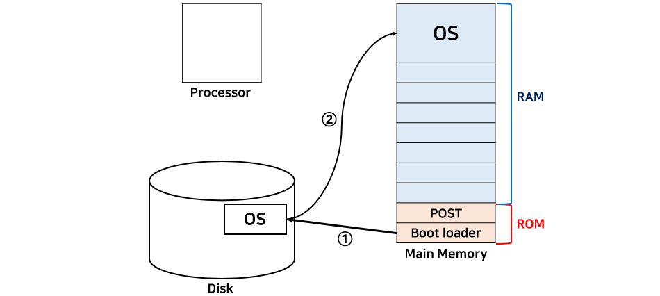

# 운영체제란?

> 하드웨어와 소프트웨어 사이에 위치
> 
> __컴퓨터 하드웨어 바로 윗단에 설치되는 소프트웨어__

## 운영체제의 목적
- 사용자에게 컴퓨터 시스템을 편리하게 사용할 수 있는 환경을 제공
  - 하드웨어의 복잡한 동작을 다루는 부분은 운영체제에서 담당, 유저는 하드웨어의 동작에 대해 몰라도 상관 없다.
- 컴퓨터 시스템의 자원(CPU, memory 등)을 효율적으로 관리

## 운영체제의 종류
- MSDos, Mac, Windows, IOS, Android
  - MSDos에서는 한 번에 하나의 작업만을 수행 가능
- 사용자 프로그램은 특정 OS에 맞춰서 만든다. (IOS 기반 앱이 Android 상에서 동작 X)

## 부팅 과정
1. 컴퓨터의 전원이 켜지면 프로세서는 메모리 0번지(ROM)에 위치하는 POST(Power-On-Self-Test)를 실행시킨다.
2. POST는 boot loader를 실행시키고 boot loader는 디스크에 있는 OS를 RAM(메인 메모리)로 가져온다.

- RAM(Random Access Memory) : 휘발성 메모리, 전원이 끊어지면 모든 데이터가 소멸
- ROM(Read Only Memory) : 비휘발성 메모리, 전원이 끊어져도 데이터가 소멸되지 않음, 읽기만 가능, 수정 불가능
- POST(Power-On-Self-Test) : 많은 데이터 장치들이 전원이 켜진 후 제일 먼저 수행하는 루틴, 이상이 없으면 부트로더 코드를 호출하는 것이 일반적
- 부트로더(Boot Loader) : 운영체제가 시동되기 이전, 미리 실행되면서 커널이 올바르게 시동되기 위해 필요한 모든 관련 작업을 마무리하고 최종적으로는 운영체제를 시동시키기 위한 프로그램

