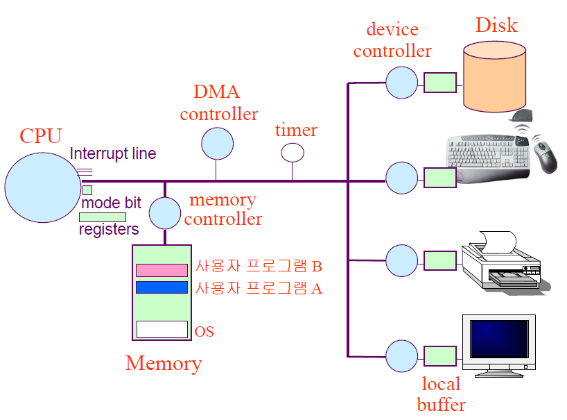

# 컴퓨터 시스템의 구조

- 컴퓨터 내부장치 : CPU, 메모리
- 컴퓨터 외부장치 : 디스크, 키보드, 마우스, 모니터, 네트워크 장치
- 컴퓨터는 외부장치에서 내부장치로 데이터를 읽어와 각종 연산을 수행한 후, 그 겨롹를 외부장치로 다시 내보내는 방식으로 업무를 처리

## 컨트롤러
> 일종의 작은 CPU

- 컴퓨터 전체의 중앙처리장치인 CPU가 있듯, 각 하드웨어 장치마다 존재하면서 이들을 제어하는 작은 CPU를 컨트롤러라고 한다.

## 커널
> 운영체제 중 항상 메모리에 올라가 있는 부분

- 운영체제는 컴퓨터가 부팅되었을 때부터 각종 자원들을 관리해야 하므로 항상 메모리에 올라가 있어야 한다.
- but, 운영체제의 모든 코드를 메모리에 상주시키면 낭비 발생, 따라서 '커널'만 상주시킴.
