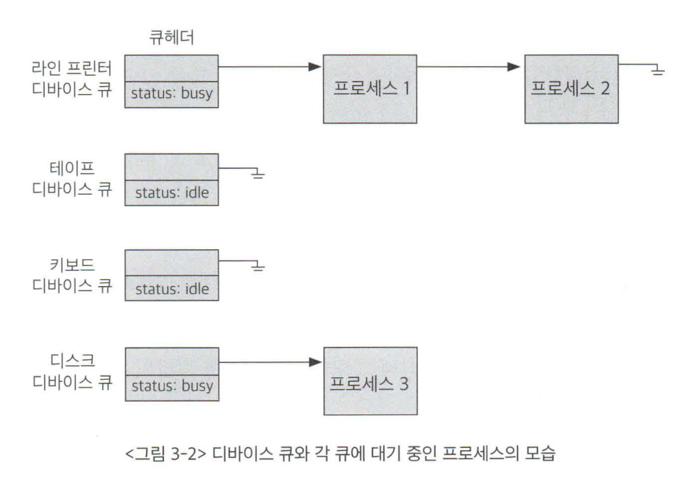

# 입출력 구조
> 입출력(I/O) : 컴퓨터 시스템이 컴퓨터 외부의 입출력 장치들과 데이터를 주고받는 것
## 입출력 방식
### 동기식 입출력 
> 어떤 프로그램이 입출력 요청을 했을 때 입출력 작업이 완료된 후에야 그 프로그램이 후속 작업을 수행할 수 있는 방식
- 입출력이 완료되어 인터럽트를 통해 그 사실이 전달된 후에야 CPU의 제어권이 그 프로그램에게 넘어가서 다음 명령을 수행할 수 있게 한다.

#### 자원 낭비 문제
- CPU는 입출력 연산이 끝날 때까지 인터럽트를 기다리며 자원 낭비를 한다.
- CPU가 쉬지 않고 일할 수 있도록 다른 프로그램에 이양 (컨텍스트 스위칭)

#### CPU 자원 낭비를 줄이기 위해 어떻게 CPU를 다른 프로그램에 이양할까?
1. 입출력 중인 프로그램은 봉쇄 상태(blocked state)로 전환
2. 봉쇄 상태의 프로그램에는 CPU를 할당하지 않는다.
3. 해당 프로그램의 입출력 처리가 완료되면 봉쇄 상태를 푼다.
4. 이러한 과정을 거침으로써 동기식이지만 다수의 입출력 연산이 동시에 요청되거나 처리 가능하다.

#### 동기화 문제
- 여러 프로그램에 CPU를 이양할 경우 여러 프로그램이 동일한 곳에 접근하여 충돌 위험이 있다.
  - EX) 프로그램 A, B가 동일한 파일에 접근한다면 동기화 문제 발생 (일반적인 동기화 문제와 동일)
- 입출력 요청의 동기화를 위해 장치별로 큐를 두어 이를 방지한다.
  - 먼제 요청한 작업별로 차례대로 처리한다. 즉, 큐에 있는 순서대로 처리해 동시성을 보장한다.

- 장치마다 큐헤더로 큐를 관리한다.
  - 입출력이 완료될 때까지 CPU가 입출력과 관련 없는 프로그램을 수행하도록 하고, 인터럽트로 입출력 연산 완료를 전달하는 방식

### 비동기식 입출력
> 입출력 연산을 요청한 후에 연산이 끝나기를 기다리는 것이 아닌, CPU의 제어권을 입출력 연산을 호출한 그 프로그램에 곧바로 다시 부여하는 방식

#### 동기식 VS 비동기식

- 동기식 입출력
  1. 운영체제의 커널로 CPU의 제어권이 넘어와서 입출력 처리와 관련된 커널의 코드가 수행된다.
  2. 입출력을 호출한 프로세스의 상태를 Blocked 상태로 바꾸어 입출력이 완료될 때까지 CPU를 할당받지 못하도록 한다.
  3. 입출력이 완료되면 I/O 컨트롤러가 CPU에게 인터럽트를 발생시켜 입출력이 끝났음을 알린다.
  4. Blocked 상태인 해당 프로세스에게 CPU를 할당받을 수 있는 권한을 준다. (Blocked 상태를 해제시켜 CPU 할당을 기다리는 줄에 설 수 있게 된다.)

- 비동기식 입출력
  1. CPU의 제어권이 입출력을 요청한 프로세스에게 곧바로 다시 주어짐
  2. 입출력 연산이 완료되는 것과 무관하게 처리 가능한 작업부터 처리한다.
  3. 동기식과 마찬가지로 인터럽트를 통해 이를 CPU에 알린다.

### 동기식 입출력의 예시
  1. 프로그램 A가 실행 중에 디스크에서 어떤 데이터를 읽어오는 명령을 만난다.
  2. 프로그램 A는 시스템 콜을 통해 CPU에게 일종의 소프트웨어 인터럽트를 발생시킨다.
  3. CPU는 프로그램 A의 코드를 실행하던 일을 멈추고 현재의 상태를 저장한 뒤 인터럽트에 의해 처리해야 할 커널의 루틴으로 이동
  4. 처리루틴으로 이동하면 CPU는 컨트롤러에게 입출력 연산 요청
  5. 컨트롤러는 A가 요청한 데이터를 디스크로부터 자신의 로컬 버퍼로 읽어온다.
  6. 읽어오는 동안에 프로그램 A는 CPU를 다시 할당받지 못하게 된다. (봉쇄 상태)
  7. CPU를 다른 프로그램 B에 할당해 CPU가 쉬지 않고 일을 할 수 있도록 한다.
  8. 원하는 정보가 로컬버퍼로 다 들어오면 컨트롤러는 CPU에게 입출력이 완료되었다는 사실을 인터럽트를 발생시킴으로써 알린다. (하드웨어 인터럽트)
  9. 프로그램 B를 수행중이던 CPU는 수행하던 지점 및 상태를 저장해놓고 인터럽트 처리
  10. 인터럽트 처리루틴은 로컬버퍼에 있는 A가 요청한 데이터를 A의 메모리 영역으로 읽어오고, A의 봉쇄 상태를 해제시켜 CPU를 기다리는 줄에 다시 설 수 있게 된다.
  11. 그 후, 원래 처리하던 프로그램 B의 지점으로 돌아가 하던 업무를 계속해서 수행하게 된다.
  12. 프로그램 A는 CPU를 기다리는 줄에서 기다리다가 자신의 차례가 되면 CPU를 할당받고 입출력 연산 이후의 작업 수행]
  
  
## DMA (Direct Memory Access)
> CPU 이외에 메모리 접근이 가능한 장치

- 원칙적으로 메모리는 CPU에 의해서만 접근 가능하고, 이외의 장치가 메모리의 데이터에 접근하기 위해서는 인터럽트를 발생시켜 CPU가 이를 대행하는 방식으로만 가능하다.
- 컨트롤러가 CPU에게 인터럽트를 발생시키면, CPU는 컨트롤러의 로컬버퍼와 메모리 사이에서 데이터를 옮기는 일을 한다.

### 인터럽트 방식으로만 메모리 접근할 시 문제점
- 입출력 장치가 메모리 접근을 원할 때마다 인터럽트에 의해 CPU 업무가 방해를 받게 되고, 이는 CPU 사용의 효율이 떨어지는 결과를 낳는다.
- 이러한 비효율성을 극복하기 위한 장치가 DMA 이다.

### DMA의 특징
- 일종의 컨트롤러로써, CPU가 입출력 장치들의 메모리 접근 요청에 의해 자주 인터럽트 당하는 것을 막아준다.
- 로컬버퍼에서 메모리로 읽어오는 작업을 CPU가 아닌 DMA가 대행한다.
- 바이트 단위가 아니라 블록(block)이라는 큰 단위로 정보를 메모리로 읽어온 후 CPU에게 인터럽트를 발생시켜 해당 작업의 완료를 알려준다.
  
