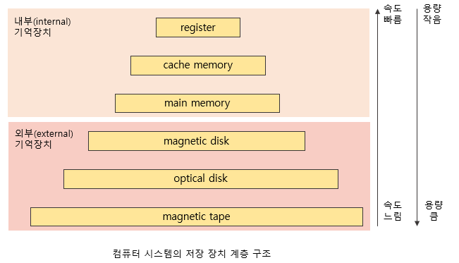

# 저장장치 구조
## 저장장치 분류
### 주기억장치
> 보통 메모리라고 부르며, 전원이 나가면 저장되었던 내용이 모두 사라져버리는 휘발성의 RAM을 매체로 사용하는 경우가 대부분

### 보조기억장치
> 전원이 나가도 저장된 내용을 기억할 수 있는 비휘발성의 마그네틱 디스크를 주로 사용

#### 용도
1. 파일 시스템
- 전원이 나가도 유지해야 할 정보가 있다면 그것을 파일 형태로 보조기억장치에 저장
2. 스왑 영역
- 메모리의 연장 공간
- 메모리의 크기가 한정적이고 가격이 상대적으로 비싸며 용량이 적기 때문에, 다수의 프로그램이 메모리에 올라가 동시에 수행되는 현대 컴퓨터 환경에서 메모리 부족이 흔히 발생
- 프로그램 수행에 당장 필요한 부분만 메모리에 올려놓고 그렇지 않은 부분은 디스크의 스왑 영역에 내려놓는다.

## 저장장치

- 당장 필요한 정보는 빠른 저장장치에 넣어두어 수행 속도를 높이고 그렇지 않은 정보는 상대적으로 느린 저장장치에 저장하게 된다.

- 캐싱 기법
  - 상대적으로 용량이 적은 빠른 저장장치를 이용해 느린 저장장치의 성능을 향상시키는 총체적 기법
  - 상대적으로 느린 저장장치에 있는 내용 중 당장 사용되거나 빈번히 사용될 정보를 빠른 저장장치에 선별적으로 저장함으로써 두 저장장치의 속도를 완충시킴

