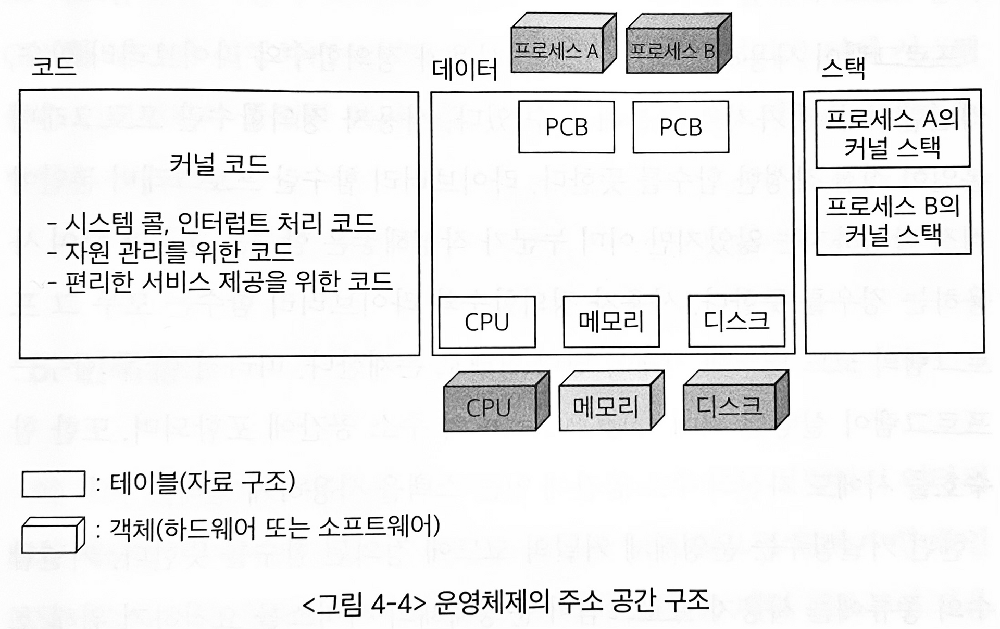

# 프로그램의 실행
> - 디스크에 존재하던 실행파일이 메모리에 적재된다.
> - 프로그램이 CPU를 할당받아 명령을 수행하고 있다.

## 운영체제의 프로그램 실행

### 운영체제 커널의 주소 공간 구성
> 운영체제 또한 하나의 프로그램이므로 운영체제 커널 역시 코드, 데이터, 스택 영역을 가지고 있다.

 
#### 코드
- CPU, 메모리 등의 자원을 효율적으로 관리함과 동시에 사용자에게 편리한 인터페이스를 제공하고자 한다.
- 시스템 콜 및 인터럽트를 처리하기 위한 부분 또한 포함한다.

#### 데이터
- CPU나 메모리같은 하드웨어 자원 뿐 아니라 수행 중인 프로그램을 관리하기 위한 자료구조가 저장된다.
  - PCB : 각 프로세스의 상태, CPU 사용 정보, 메모리 사용 정보 등을 유지하기 위한 자료구조

#### 스택
- 함수 호출 시에 복귀 주소를 저장하기 위한 용도
- 커널의 스택은 일반 사용자 프로그램의 스택과는 달리 현재 수행중인 프로세스마다 별도의 스택을 두어 관리한다.
  - 커널은 일종의 공유코드로써 모든 사용자 프로그램이 시스템 콜을 통해 커널의 함수에 접근할 수 있으므로,   일관성 유지를 위해 각 프로세스마다 커널 내에 별도의 스택을 두게 된다.
- 일반 프로그램이 시스템 콜을 했거나 인터럽트가 발생해 CPU 할당이 운영체제로 넘어가면 프로그램의 복귀 주소를 자신의 스택이 아닌 커널의 데이터 영역에 있는 PCB에 저장한다. 
- 커널 영역에서 이뤄지는 함수 호출은 직전에 CPU를 갖고 있던 프로세스의 커널스택을 사용한다.

## 사용자 프로그램이 사용하는 함수
### 사용자 정의 함수
> 프로그래머 본인이 직접 작성한 함수를 뜻함
### 라이브러리 함수
> 프로그래머 본인이 직접 작성하지는 않았지만, 이미 누군가 작성해놓은 함수를 호출만 하여 사용하는 경우를 뜻함
### 커널함수
> 운영체제 커널의 코드에 정의된 함수
- 사용자 프로그램의 주소 공간에 코드가 존재하는 것이 아닌, 운영체제 커널의 주소 공간에 코드가 정의된다.
- EX) 삼각함수인 sin() 함수는 라이브러리 함수이고, 화면에 문자열을 출력하는 printf() 함수는 그 자체로는 라이브러리 함수이지만, 궁극적으로 특권명령인 입출력을 수반하므로 printf() 내에서 커널 함수를 호출하는 시스템 콜을 동반한다.
#### 시스템 콜 함수
- 사용자 프로그램이 운영체제의 서비스를 요청하기 위해 호출하는 함수
#### 인터럽트 처리 함수
- 각종 하드웨어 및 소프트웨어가 CPU의 서비스를 요청하기 위해 발생시키는 함수

