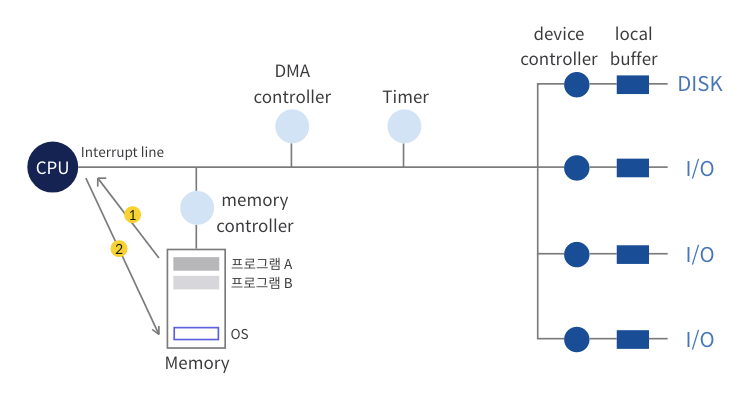

# 인터럽트와 시스템 콜
## 인터럽트
> CPU는 매번 프로그램 카운터가 가리키는 곳에 있는 명령을 수행하는 일밖에 하지 않음  
> 현재 수행 중인 프로세스로부터 CPU를 회수해 CPU가 다른 일을 수행하도록 하는 인터럽트 메커니즘 필요

### 인터럽트 메커니즘 기본
1. CPU는 프로그램 카운터가 가리키는 곳에 있는 명령을 순차적으로 수행한다.
2. 다음 명령을 수행하기 전에 인터럽트 라인이 세팅되었는지를 체크한다.
3. 인터럽트가 발생했다면 CPU는 현재 수행하던 프로세스를 멈추고 OS의 인터럽트 처리루틴으로 이동하여 인터럽트를 처리한다.
4. 인터럽트의 처리가 마무리되었다면 인터럽트 발생 직전의 프로세스에 CPU의 제어권이 다시 넘어간다.

### 인터럽트 처리 중 또 다른 인터럽트가 발생했다면?
- 원칙적으로는 데이터의 일관성이 유지되지 않기 때문에 다른 인터럽트의 발생을 허용하지 않는다.
  > 운영체제 커널에 정의된 데이터를 변경 중 다른 인터럽트가 끼어들어 데이터를 또다시 변경한다면 의도치 않은 결과값으로 변할 수 있다.

- BUT, 우선순위가 높은 인터럽트가 발생하면 처리중이던 인터럽트 코드의 수행 지점을 저장하고 중요한 인터럽트를 먼저 처리한다. 이후에 다시 저장한 지점으로 돌아와 마저 처리한다.

## 시스템 콜
> 커널이라는 다른 프로그램의 주소 공간에 존재하는 함수를 호출하는 것

### 일반적인 함수 호출 vs 시스템 콜
#### 일반적인 함수 호출
> 자신의 스택에 복귀 주소를 저장한 후 호출된 함수 위치로 점프하는 것
#### 시스템 콜
> 프로그램 자신이 인터럽트 라인에 인터럽트를 세팅하는 명령을 통해 수행

### 프로그램이 CPU를 빼앗기는 경우
#### 타이머에 의한 인터럽트 발생
- 특정 프로그램이 CPU를 독점하는 것을 방지하기 위해 할당 시간이 만료되면 인터럽트를 발생시키는 것이다.
#### 입출력 요청을 위한 시스템 콜
- 입출력을 위해 시스템 콜로 커널의 함수를 호출할 때, 입출력 함수의 호출이 자신의 주소 공간에서 이루어질 수 없기 때문에 CPU 제어권을 운영체제로 넘기는데, 이게 인터럽트 라인 세팅을 통해 이루어지는 것이다.
- 시스템 콜이 들어오더라도 CPU는 로컬 버퍼에 다 옮기고 인터럽트가 발생할 때까지 다른 프로세스에 할당된다.

## 프로세스의 두 가지 상태

### 사용자모드에서의 실행 상태 (user mode running)
> 사용자 정의 함수, 라이브러리 함수 사용

### 커널모드에서의 실행 상태 (kernel mode running)
> 커널의 시스템 콜 함수 실행

- 프로세스 A가 시스템 콜을 해 실행되는 것이 커널의 코드이지만 사실상 프로세스가 할 일을 대행하기에 커널 모드에서 실행 중이라고 구분지어 이야기한다.
- 프로그램이 끝나면 커널 모드로 진입해 종료한다.
