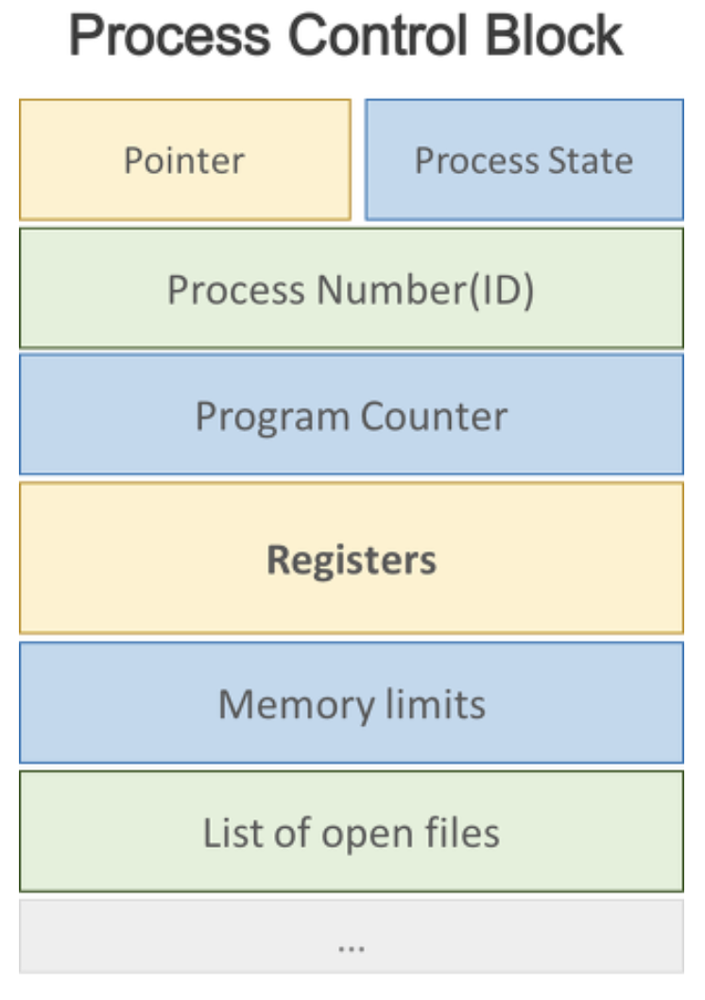

# 프로세스
## 프로세스란?
> 프로세스란 실행 중인 프로그램을 뜻한다. 디스크에 실행파일 형태로 존재하던 프로그램이 메모리에 올라가서 실행되기 시작하면 비로소 생명력을 갖는 프로세스가 된다.

## 프로세스의 문맥
### 프로세스 문맥(Process Context)이란?
> 프로세스가 현재 어떤 상태에서 수행되고 있는지 정확히 규명하기 위해 필요한 정보
- 여러 프로세스가 함께 수행되는 시분할 시스템 환경에서는 타이머 인터럽트에 의해 짧은 시간 동안 CPU를 사용한 후 빼앗겼다가 추후에 다시 CPU를 획득하는 식으로 관리된다.
- 이 때 정확한 재현을 위해 필요한 정보가 프로세스 문맥이다.

### 프로세스 문맥의 종류 3가지
#### 하드웨어 문맥
- CPU의 수행 상태를 나타낸다.
- 프로그램 카운터 값, 각종 레지스터에 저장하고 있는 값들을 의미한다.
#### 프로세스의 주소 공간
- 프로세스의 코드, 데이터, 스택
- 프로세스는 자기 자신만의 독자적인 주소 공간을 가진다.

#### 코드 영역 : 컴파일 타임에 할당
- 프로그램의 소스코드가 위치하는 영역이다.
- 형태는 Hex 또는 binary로 기계어다.
- CPU는 코드 영역에 위치한 명령어를 하나씩 가져와서 처리한다.

#### 데이터 영역 : 컴파일 타임에 할당
- 전역(global) 변수와 정적(static) 변수가 위치하는 영역이다.
- 프로그램의 시작과 동시에 할당되고 프로그램이 종료되어야 메모리에서 소멸된다.
- 데이터 영역에는 BSS(Block Stated Symbol)라는 영역이 존재한다.
- 초기화 되지 않거나, 초기화를 0으로 하거나, 초기화를 NULL로한 전역 변수와 정적 변수는 BSS 영역에 위치한다.
- BSS라는 영역이 왜 존재할까? 이는 공간을 효율적으로 활용하기 위해서다.
- 아래 코드를 보자. 배열 a의 크기는 400000 바이트다. 하지만 선언만하고 값이 들어있지 않기에 굳이 400000 바이트라는 공간을 할당할 필요가 없다. 따라서 a 배열의 크기와 이름에 대한 정보는 BSS에 올려서 공간을 효율적으로 활용한다.

#### 힙(Heap) 영역 : 런타임에 할당
- 프로그래머에 의해 메모리 공간이 동적으로 할당되고 해제되는 영역이다.
- C언어의 malloc(), free() 등의 함수를 생각해보자.
- 힙 영역은 메모리의 낮은 주소에서 높은 주소의 방향으로 할당된다.

#### 스택(Stack) 영역 : 런타임에 할당
- 지역(local) 변수와 매개 변수(parameter)가 위치하는 영역이다.
- 함수의 호출과 동시에 할당되고 함수의 호출이 완료되면 메모리에서 소멸된다.
- 함수가 호출되면 push 되고 함수가 종료되면 pop 되는 것이다.
- 스택 영역은 메모리의 높은 주소에서 낮은 주소의 방향으로 할당된다.
- 컴파일 타임은 소스코드가 컴파일이라는 과정을 통해 기계어 코드로 변환되어 실행 가능한 프로그램이 되는데 걸리는 시간이다.
- 런타임은 컴파일 과정을 마친 기계어 형태의 프로그램이 실행되는 시간이다. 즉, 프로그램이 동작되는 시간이다.

#### 커널상의 문맥
- 프로그램이 수행되어 프로세스가 되면 운영체제는 프로세스를 관리하기 위한 자료구조를 유지한다.
- PCB, 커널 스택이 '커널 상의 문맥'을 구성한다.

## 프로세스의 상태

### 시작 상태 (new)
- 프로세스가 시작되어 그 프로세스를 위한 각종 자료구조는 생성되었지만, 아직 메모리 획득을 승인받지 못한 상태

### 실행 상태 (running)
- 프로세스가 CPU를 보유하고 기계어 명령을 실행하고 있는 상태

### 준비 상태 (ready)
- 프로세스가 CPU만 보유하면 당장 명령을 실행할 수 있지만 CPU를 할당받지 못한 상태를 가리킨다. 

### 봉쇄 상태 (waiting, blocked)
- CPU를 할당받더라도 당장 명령을 실행할 수 없는 프로세스의 상태를 말한다. 봉쇄 상태의 예로는 프로세스가 요청한 입출력 작업이 진행 중인 경우를 들 수 있다. 

### 완료 상태 (terminated)
- 프로세스가 종료되었으나 운영체제가 그 프로세스와 관련된 자료구조를 완전히 정리하지 못한 상태를 말한다.

## 프로세스 제어블록 (Process Control Block, PCB)
> 운영체제가 시스템 내의 프로세스들을 관리하기 위해 프로세스마다 유지하는 정보들을 담는 커널 내의 자료구조

### 구성 요소
- 프로세스의 상태 : CPU를 할당해도 되는지 여부를 결정
- 프로그램 카운터 값 : CPU가 수행할 명령의 위치를 가리킴
- CPU 레지스터 값 : CPU 연산을 위해 현 시점에 레지스터가 어떤 값을 저장하고 있는지 나타냄
- CPU 스케줄링 정보 : CPU 스케줄링에 필요한 정보
- 메모리 관리 정보 : 메모리 할당을 위해 필요한 정보
- 자원 사용 정보 : 사용자에게 자원 사용 요금을 계산해 청구하는 용도
- 입출력 상태 정보 : 프로세스가 오픈한 파일 정보 등 프로세스의 입출력 관련 상태 정보
