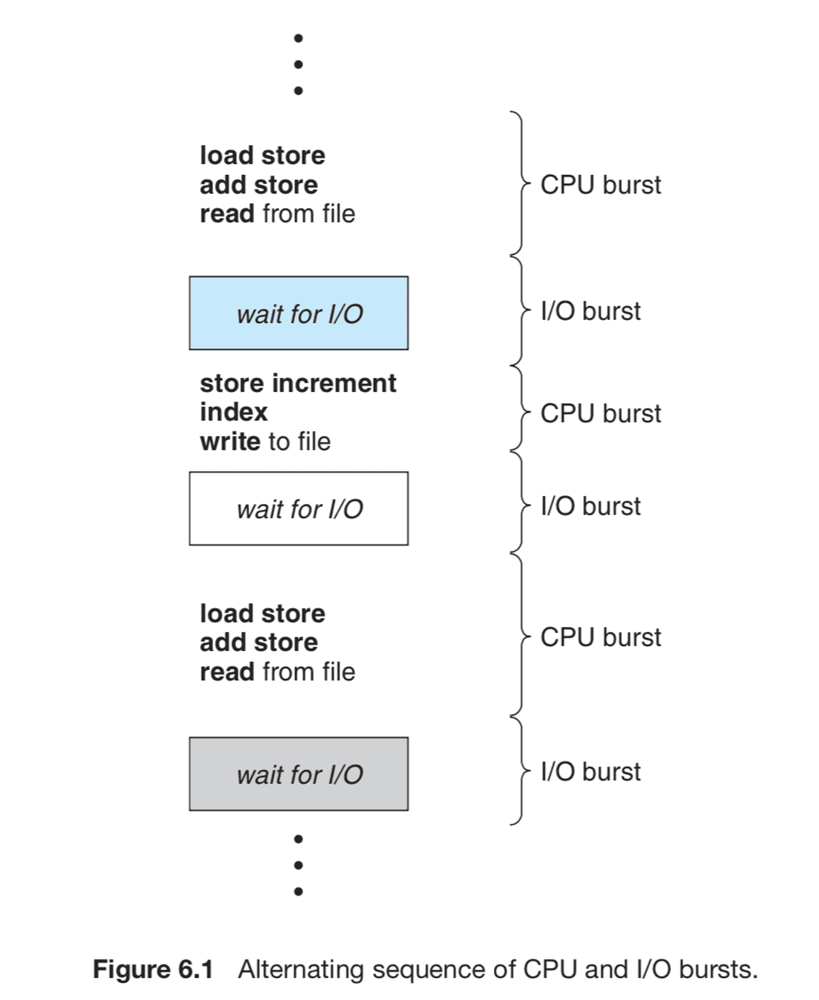

# CPU 스케줄링 개요
> 프로그램이 시작되어 메모리에 올라가면 프로그램 카운터라는 이름의 레지스터가 현재 CPU에서 수행할 코드의 메모리 주소값을 가지고 있게 된다. 그러면 CPU는 프로그램 카운터가 가리키는 주소의 기계어 명령을 하나씩 수행하게 된다.

## 기계어 명령 구분
### CPU 내에서 수행되는 명령
- Add 명령 : CPU 내의 레지스터에 있는 두 값을 더해 레지스터에 저장하는 명령
- CPU 내에서만 수행되므로 명령의 수행 속도가 매우 빠르다.
### 메모리 접근을 필요로 하는 명령
- Load 명령 : 메모리에 있는 데이터를 CPU로 읽어들이는 명령
- Store 명령 : CPU에서 계산된 결과값을 메모리에 저장하는 명령
- CPU 내에서 수행되는 명령보다는 길지만 비교적 짧은 시간에 수행할 수 있는 명령
### 입출력을 동반하는 명령
- 키보드, 모니터 등의 입출력 작업, 디스크로부터 파일 데이터를 읽어오는 작업, 컴퓨터에서 처리된 결과를 디스크에 파일 형태로 저장하는 명령은 CPU나 메모리 접근 명령에 비해 대단히 오랜 시간이 소요된다.
- 모든 입출력 명령은 특권명령이므로 운영체제를 통해 서비스를 대행해야 한다.

## 사용자 프로그램이 수행되는 과정
> CPU 작업과 입출력 작업의 반복으로 구성된다.

### CPU 버스트와 I/O 버스트
#### CPU 버스트 
> CPU 직접 명령 수행, 빠르다.
- 프로그램이 I/O를 한 번 수행하고 다음 I/O를 수행할 때까지 직접 CPU를 가지고 명령을 수행하는 일련의 작업
#### I/O 버스트
> 입출력 작업, 느리다.
- I/O 작업이 요청된 후 완료되어 다시 CPU 버스트로 돌아가기까지 일어나는 일련의 작업

### I/O 바운드 프로세스와 CPU 바운드 프로세스
#### I/O 바운드 프로세스
- I/O 요청이 많아서 CPU 버스트가 짧게 나타나는 프로세스 : 대화형 프로그램
#### CPU 바운드 프로세스
- I/O 작업을 거의 수행하지 않아서 CPU 버스트가 길게 나타나는 프로세스 : 계산 위주의 프로그램

## CPU 스케줄링이 필요한 이유
- 사용자 프로그램이 수행되는 과정은 CPU 작업과 I/O 작업의 반복이다.
- 프로그램의 수행 중에 I/O를 요청하면 CPU의 제어권이 운영체제 커널로 넘어갈 뿐 아니라 상대적으로 매우 느린 입출력 장치의 접근이 필요하게 된다.
- 현대의 시분할 시스템에서는 이와 같이 CPU 작업과 I/O 작업의 비율이 균일하지 않은 다양한 프로그램들이 공존하므로 효율적인 CPU 스케줄링 기법이 반드시 필요하다.
