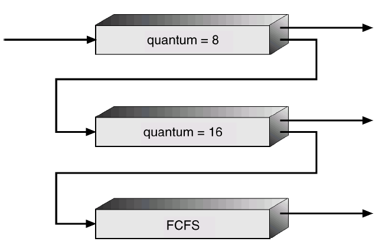

# 스케줄링 알고리즘
## 선입선출 스케줄링 (First Come First Served, FCFS)
> 프로세스가 준비 큐에 도착한 시간 순서대로 CPU를 할당하는 방식
- 프로세스가 자발적으로 CPU를 반납할 때까지 빼앗지 않음
- 콘보이 현상 (Convoy Effect) : CPU를 잠깐만 할당받으면 되는 프로세스는 앞의 긴 작업을 기다려야 하기 때문에 평균 대기시간은 물론 I/O 장치들의 이용률까지 동반 하락

## 최단작업 우선 스케줄링 (Shortest Job First, SJF)
> CPU 버스트가 가장 짧은 프로세스에게 제일 먼저 CPU를 할당하는 방식, 평균 대기시간을 가장 짧게 만드는 최적 알고리즘
### 비선점형 방식
- 일단 CPU를 획득하면 자진반납할 때까지 빼앗지 않음
### 선점형 방식 (Shortest Remaining Time First : SRTF)
- 할당받아도 더 짧은 프로세스가 도착할 경우 빼앗아 더 짧은 프로세스에 부여, 일반적인 시분할 환경에서 평균 대기시간을 가장 많이 줄일 수 있는 방식

### 기아 현상 (Starvation)
- 프로세스의 CPU 버스트 시간을 미리 알 수 없으므로 과거의 CPU 버스트 시간을 통해 CPU 버스트 시간을 예측한 뒤 예측치가 가장 짧은 프로세스에게 CPU 할당
- __CPU 버스트가 긴 프로세스는 준비 큐에서 무한정 기다려야 하는 문제__

## 우선순위 스케줄링 (Priority Scheduling)
> 준비 큐에서 기다리는 프로세스들 중 우선순위가 가장 높은 프로세스에게 먼저 CPU를 할당하는 방식
- 우선순위는 우선순위값을 통해 표시, 작을수록 높은 우선순위
- 우선순위를 결정하는 지표로 CPU 버스트 시간을 사용하면 SJF 알고리즘과 동일한 의미

### 비선점형 방식
- 일단 CPU를 획득하면 자진반납할 때까지 빼앗지 않음
### 선점형 방식
- 할당받아도 우선순위가 더 높은 프로세스가 도착하면 CPU를 빼앗아 더 높은 프로세스에게 부여

### 기아 현상
- 우선순위가 낮은 프로세스는 CPU를 얻지못한 채 계속 기다려야 함
#### 노화 기법 (Aging)
- 기다리는 시간이 길어지면 우선순위를 조금씩 높여 언젠가는 CPU를 할당받을 수 있게 해주는 방법

## 라운드 로빈 스케줄링 (Round Robin)
> 시분할 시스템의 성질을 가장 잘 활용한 스케줄링 방식
- 각 프로세스가 CPU를 연속적으로 사용할 수 있는 시간을 특정 시간으로 제한하고 이 시간이 지나면 CPU를 빼앗음
### 할당 시간
> 각 프로세스마다 한 번에 CPU를 연속적으로 사용할 수 있는 최대시간
#### 긴 할당 시간 
- FCFS와 같은 결과, CPU 버스트 시간이 매우 긴 프로세스가 모든 작업을 수행할 만큼 할당시간을 길게 설정하는 경우
#### 짧은 할당 시간
- CPU를 사용하는 프로세스가 빈번하게 교체되어 문맥교환 오버헤드 발생

### 정보
- 프로세스 n개, 할당시간 q인 경우, 모든 프로세스는 (n-1)q 시간 내에 적어도 한 번 CPU를 할당받을 수 있음
- 대화형 프로세스의 빠른 응답시간을 보장할 수 있음
- CPU 버스트 시간이 짧은 프로세스가 빨리 CPU를 얻을 수 있고, CPU 버스트 시간이 긴 프로세스가 불이익을 당하지 않도록 함 ⇒ 공정한 스케줄링 방식
- 일반적으로 SJF 방식보다 평균 대기시간을 길지만, 응답시간은 더 짧음
- 할당시간이 만료되면 타이머 인터럽트를 발생해 CPU 회수, CPU 버스트 시간이 할당시간보다 짧으면 사용완료 후 스스로 반납

### FCFS vs 라운드 로빈
- FCFS : 프로세스를 하나씩 끝내는 방식이므로, 평균 대기시간이나 평균 소요시간 측면에서 좋은 결과를 얻을 수 있지만 프로세스 간 대기시간이나 소요시간의 편차가 매우 크며, 평균 응답시간이 지나치게 길어지는 문제가 있음
- 라운드로빈 : CPU를 조금씩 같이 쓰고 거의 동시에 끝나게 되어 대기시간이나 처리시간의 편차는 크지 않지만, 평균 대기시간과 평균 소요시간이 길어 비효율적

⇒  동일한 CPU 버스트 시간을 가지는 프로세스들에 라운드 로빈 스케줄링을 적용하면 평균 대기시간과 평균 소요시간은 FCFS의 거의 두 배, 하지만 평균 응답시간은 더 짧음

## 멀티레벨 큐
> 준비 큐를 여러 개로 분할해 관리하는 스케줄링 기법, 즉 프로세스들이 한 줄이 아닌 여러 줄로 기다리는 것
- 성격이 다른 프로세스들을 별도로 관리하고, 프로세스의 성격에 맞는 스케줄링을 적용하기 위해 준비 큐를 분리
  - 예를 들면, 빠른 응답을 필요로 하는 대화형 작업과 그렇지 않은 작업을 분리
- 하나뿐인 CPU를 어느 줄에 먼저 스케줄링할 것인가 + 프로세스가 도착했을 때 어느 줄에 세울 것인가
### 전위큐 (foreground queue) : 대화형 작업
  - 응답시간을 짧게 하기 위해 라운드 로빈 스케줄링을 사용
### 후위큐 (background queue) : 계산 위주의 작업
  - 응답시간이 큰 의미를 가지지 않기 때문에 FCFS 사용해 문맥교환의 오버헤드 줄임
### 큐 자체의 스케줄링 
> 어느 큐에 먼저 CPU를 할당할 것인지 결정하는 스케줄링
#### 고정 우선순위 방식
- 큐에 고정 우선순위를 부여해 우선순위가 높은 큐를 먼저 서비스한다.
#### 타임 슬라이스 방식
- 각 큐에 CPU 시간을 적절한 비율로 할당 (80:20), 큐에 대한 기아 현상을 해소할 수 있는 방식

## 멀티레벨 피드백 큐

- 멀티레벨 큐와 동일하나, 프로세스가 하나의 큐에서 다른 큐로 이동가능하다는 점이 추가됨
- 프로세스들의 다양한 성격을 반영해 구현가능, 에이징(aging)을 이와 같은 방식으로 구현가능

### 멀티레벨 피드백 큐를 정의하는 파라미터들
1) 큐의 수
2) 각 큐의 스케줄링 알고리즘
3) 프로세스를 상위 큐로 승격시키는 기준
4) 프로세스를 하위 큐로 강등시키는 기준
5) 프로세스가 도착했을 때 들어갈 큐를 결정하는 기준

### 과정
1. CPU 버스트가 긴 프로세스들은 처음 8만큼 CPU를 사용하고도 작업이 완료되지 않는다면, 
2. 16인 하위큐로 내려가서 줄서고 본인 차례가 되어 16만큼을 추가로 사용하고도 작업이 완료되지 않는다면,
3. CPU를 오래 사용하는 계산 위주의 프로세스로 간주되어 최하위 큐로 이동해 FCFS 스케줄링을 적용
> 작업시간이 짧은 프로세스일수록 더욱 빠른 서비스가 가능하고, 작업시간이 긴 프로세스에 대해선 문맥교환 오버헤드를 줄인다.

## 다중처리기 스케줄링
> CPU가 여러 개인 시스템
- 프로세스를 준비 큐에 한 줄로 세워서 각 CPU가 알아서 다음 프로세스를 꺼내가도록 한다.
- 여러 줄로 줄세우기 하는 경우 CPU 작업이 편중될 수 있어 로드밸런싱 필요

## 실시간 스케줄링
> 실시간 시스템에서는 각 작업마다 주어진 데드라인이 있음
### 경성 실시간 시스템
- 데드라인을 반드시 지켜야 함
- 정해진 시간 안에 반드시 작업이 완료되도록 스케줄링

### 연성 실시간 시스템
- 데드라인이 존재하기는 하나 지키지 못했다고 위험한 상황이 발생하지 않음

