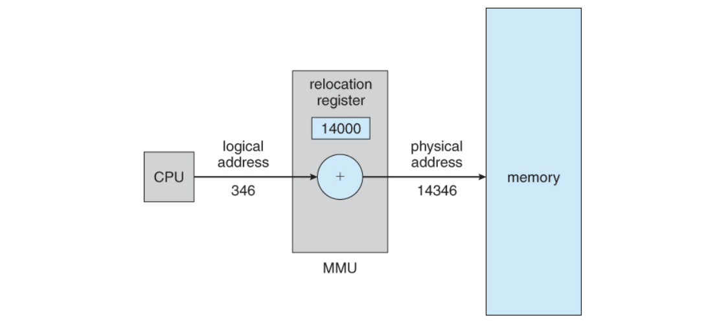

# 주소 공간과 바인딩
## 주소 (Address)
> 서로 다른 위치를 구분하기 위해 사용하는 일련의 숫자로 구성된 단위

- 컴퓨터는 이진수로 주소를 표현한다.
- 컴퓨터는 byte 단위로 메모리 주소를 부여한다.

## 주소 바인딩
### 논리적 주소 (가상 주소)
- 메모리에 적재되는 프로세스를 위한 독자적인 주소 공간
- 논리적 주소는 각 프로세스마다 독립적으로 할당되며 0번지부터 시작된다.
### 물리적 주소
- 물리적 메모리(RAM)에 실제로 올라가는 위치를 말한다.
- 낮은 주소 영역에는 운영체제가 올라가고, 높은 주소 영역에는 사용자 프로세스들이 올라간다.
### 주소 바인딩이란?
- 프로세스가 실행되기 위해서는 해당 프로그램이 물리적 메모리에 올라가 있어야 한다.
- __프로세스의 논리적 주소를 물리적 주소로 연결시켜주는 작업을 주소 바인딩이라고 한다.__ 
### 주소 바인딩의 방식
#### 컴파일 타임 바인딩
> 컴파일 시점에 해당 프로그램이 물리적 메모리의 몇 번지에 위치할 것인지 결정
- 프로그램이 절대주소로 적재된다는 의미, 주소를 변경하기 위해선 다시 컴파일해야 한다.
#### 로드 타임 바인딩
> 프로그램 실행 시점에 로더에 의해 해당 프로그램이 물리적 메모리의 몇 번지에 위치할 것인지 결정
- 프로그램이 종료될 때까지 물리적 메모리상의 위치는 고정
- __로더__ : 사용자 프로그램을 메모리에 적재시키는 프로그램
#### 실행시간 바인딩
> 프로그램이 실행을 시작한 후에도 그 프로그램이 위치한 물리적 메모리 상의 주소가 변경될 수 있는 방식
- CPU가 메모리를 참조할 때마다 물리적 메모리에서 주소 매핑 테이블을 이용하여 데이터의 위치를 찾는다.
- 이를 위해선 기준 레지스터, 한계 레지스터, MMU(Memory Management Unit)라는 하드웨어의 지원이 필요하다.

### MMU 기법

> 논리적 주소 + 기준 레지스터 값 = 물리적 주소
- CPU가 논리적 주소를 참조하려고 할 때 MMU 기법은 그 주소값에 기준 레지스터의 값을 더해 물리적 주소값을 얻어낸다.
- 즉, MMU 기법에서는 프로그램의 주소 공간이 물리적 메모리의 한 장소에 연속적으로 적재되는 것으로 가정한다.
- 기준 레지스터 (재배치 레지스터) : 현재 CPU에서 수행중인 프로세스의 물리적 메모리 시작 주소가 저장되어 있다.
