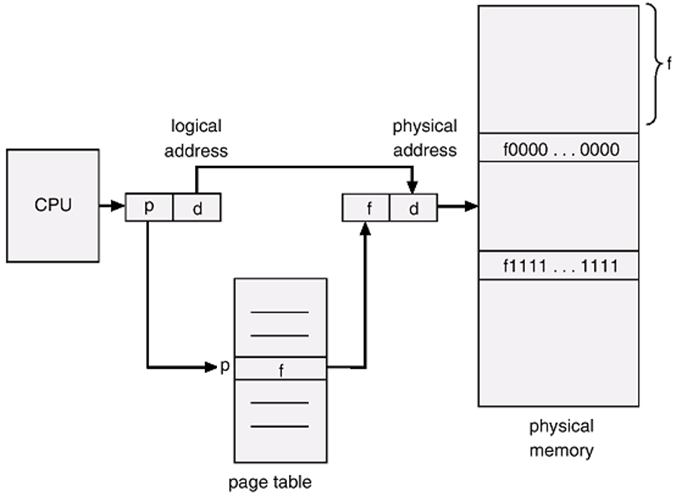

# 페이징 기법
> 프로세스의 주소 공간을 동일한 크기의 페이지 단위로 나누어 물리적 메모리의 서로 다른 위치에 페이지들을 저장하는 방식

## 주소 변환 기법

- CPU가 사용하는 논리적 주소를 페이지 번호(p)와 페이지 오프셋(d)으로 나누어 주소 변환에 사용한다.

### 페이지 번호(p)
> 각 페이지별 주소 변환 정보를 담고 있는 페이지 테이블 접근 시의 인덱스(index)
- 해당 인덱스의 항목(entry)에는 그 페이지의 물리적 메모리상의 기준 주소(base address), 즉 시작 위치가 저장된다.
- 특정 프로세스의 p번째 페이지가 위치한 물리적 메모리의 시작 위치를 알고 싶다면 해당 프로세스의 페이지 테이블에서 p번째 항목을 찾아보면 된다.

### 페이지 오프셋(d)
> 하나의 페이지 내에서의 변위
- 기준 주소값에 변위를 더함으로써 요청된 논리적 주소에 대응하는 물리적 주소를 얻을 수 있다.

## 페이지 테이블의 구현
### 페이지 테이블
> 페이징 기법에서 주소 변환을 하기 위한 자료구조, 물리적 메모리에 위치

## 계층적 페이지
## 2단계 페이징 기법
## 역페이지 테이블
## 공유 페이지
## 메모리 보호
